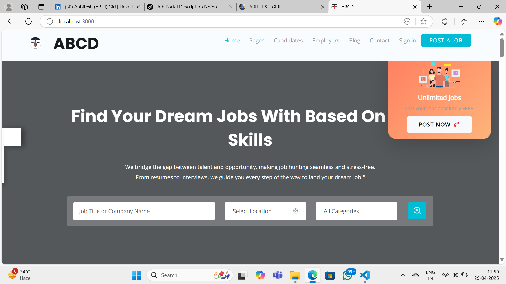
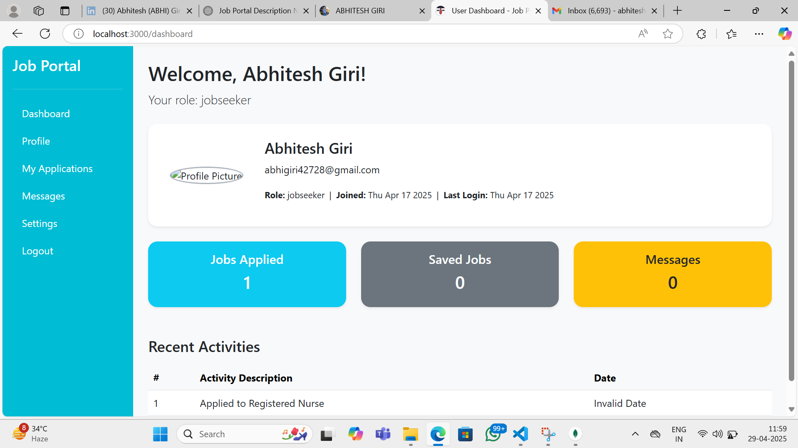

🚀 Job Portal Website — Noida Client Project
A complete, professional-grade Job Portal built to connect recruiters and job seekers seamlessly. Designed for a Noida-based client, this platform makes hiring faster, easier, and smarter.

(You can replace this placeholder with your project banner if you want!)

✨ Key Features
✅ Secure User Registration & Login with OTP email verification
✅ Google and Facebook social logins
✅ Post, Edit, and Manage Jobs easily (Recruiter Dashboard)
✅ Search, Apply, and Track Applications (Job Seeker Dashboard)
✅ Dynamic Email Notifications (Account creation, job posting, application updates)
✅ Admin Panel to manage users and listings
✅ Fully Responsive (Mobile, Tablet, Desktop) — Built with Bootstrap 5
✅ Advanced Search Filters (location, keywords, experience)

| Frontend | Backend | Database | Authentication | Other Tools |
|:--------:|:-------:|:---------:|:---------------:|:-----------:|
| HTML5, CSS3, JS, Bootstrap 5 | Node.js, Express.js | MongoDB (Mongoose) | JWT, Google OAuth, Facebook OAuth | Nodemailer, Cloudinary (if used), bcrypt |

/public          → Static Assets (CSS, JS, Images)
/src
  /routes        → API Endpoints (User, Recruiter, Admin)
  /controllers   → Business Logic
  /models        → MongoDB Models
  /views         → Frontend Templates (Optional)
  /config        → Config Files (DB, OAuth, Mail)
app.js           → Main Server File
.env             → Environment Variables

## 📸 Screenshots

### 🏠 Home Page

### 📋 Recruiter Dashboard

🔥 Highlighted Functionalities
Fast job posting and approval system 🔥

Real-time email notifications 📧

OAuth login support for faster registration ⚡

Modern, mobile-first design 🎨

Clean code with MVC architecture 🧹

📄 License
This project was custom-built for a Noida-based client.
Usage for other purposes requires permission.

| 🙋‍♂️ About the Developer

|:--------------------------------------------------------------------------------------------------------------|
                                                    Abhitesh
                                              Full Stack Developer

• 🔗 [LinkedIn Profile](https://www.linkedin.com/in/abhitesh-giri-3924a3245/)  
• 🔗 [Portfolio](https://abhiteshgiri.github.io/portfolio/) 
• ✉️ Contact: abhiteshgiri325@gmail.com

                                     🎯 Ready to Transform Hiring Experiences!

# 🚀 Job Portal Website

